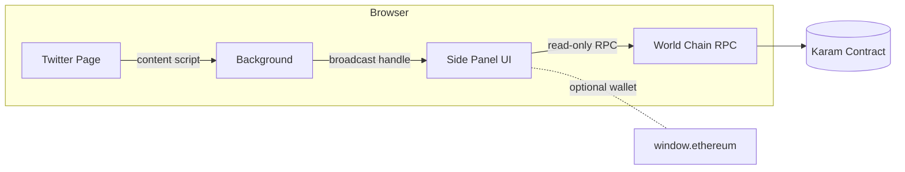
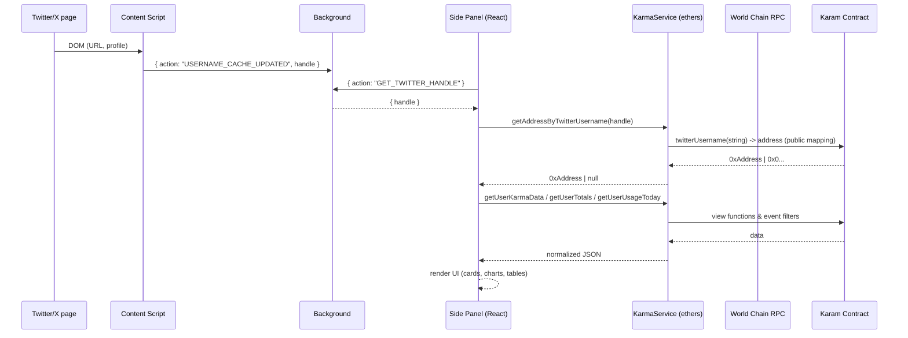
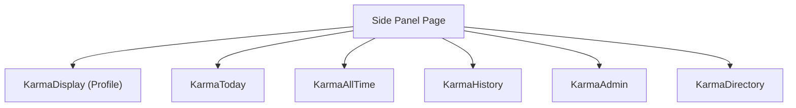

# Karma Side-Panel (Twitter → World Chain)

A minimal, responsive **browser side-panel** (Chrome/Edge/Brave) that detects the currently viewed **Twitter/X handle**, resolves the corresponding **on-chain address** via the **Karam** contract on **World Chain mainnet**, and renders a complete karma profile:

- **Profile** (address, registration, karma, socials)
- **Today** (daily usage vs limits)
- **All-time** (received, slashed, net, top counterparts, reputation)
- **History** (chronological events, daily chart)
- **Admin/System** (chain, contract, parameters, counts)
- **Directory/Leaderboard** (top users; search/sort/paginate)

The UI is tuned for **side-panels**: compact typography, strong black-and-white style, and **responsive from 250px** wide to full height.

---

## Table of Contents

- [Demo](#demo)
- [Architecture](#architecture)

  - [High-level](#high-level)
  - [Data Flow (sequence)](#data-flow-sequence)
  - [UI Composition](#ui-composition)

- [Contract](#contract)
- [Project Structure](#project-structure)
- [Getting Started](#getting-started)
- [Configuration](#configuration)
- [Build & Run](#build--run)
- [How It Works](#how-it-works)

  - [Handle Detection](#handle-detection)
  - [Chain Reads](#chain-reads)
  - [Events & History](#events--history)
  - [Directory/Leaderboard](#directoryleaderboard)

- [Styling & Responsiveness](#styling--responsiveness)
- [Security & Permissions](#security--permissions)
- [Troubleshooting](#troubleshooting)
- [Contributing](#contributing)
- [License](#license)

---

## Demo

- Open any **Twitter profile** (e.g. `twitter.com/someuser`).
- Open the extension side-panel.
- The panel shows `@someuser` → resolves their address → fetches & displays all sections.
- Works in **250px min width** (side-panel) and scales up gracefully.

---

## Architecture

### High-level



- **Content script** scrapes the current Twitter handle.
- **Background** caches + notifies panel on SPA route changes.
- **Side Panel** (React + Tailwind) calls **KarmaService** (ethers v6) → **World Chain RPC** → **Karam** contract.

### Data Flow (sequence)



### UI Composition



All views are stacked with separators in a **single scroll**.

---

## Contract

- **Network:** World Chain **mainnet** (chain id **480**)
- **Address:** `0x0d1F32D0048DBeC6A3Ac3dA7dc84BE5cd47e5cE4`
- **ABI:** included in `constants/contract.ts`
- **Public mapping:** `twitterUsername(string) -> address` (fast O(1) handle → address)
- **Helper view:** `getAllUsers() -> address[]` (fast directory)

> ⚠️ We keep your constant names (`WORLDSEPOLIA_KARAM_CONTRACT_ADDRESS`, `WORLD_SEPOLIA_RPC`) **but swap values to mainnet** for simplicity.

---

## Project Structure

```
/src
  /components
    KarmaDisplay.tsx        # Profile
    KarmaToday.tsx          # Daily usage
    KarmaAllTime.tsx        # Totals + top counterparts + reputation
    KarmaHistory.tsx        # Event list, daily chart
    KarmaAdmin.tsx          # Chain/contract info
    KarmaDirectory.tsx      # Leaderboard, search/sort/paginate
  /components/ui            # shadcn/ui primitives (Card, Badge, Separator, etc.)
  /services
    KarmaService.ts         # All chain reads & event queries (ethers v6)
  /constants
    contract.ts             # Address, ABI, RPC
  /panel
    Index.tsx               # Side panel root: renders all 6 sections
  /styles
    index.css               # bold black/white theme, 250px min
    app.css                 # app base

/extension
  background.ts             # twitter handle cache + broadcasting
  content-script.ts         # extracts @handle from DOM
  manifest.json             # MV3, permissions, sidePanel config
```

---

## Getting Started

```bash
# 1) Install
pnpm install
# or: npm install / yarn

# 2) Dev build (Vite or CRA depending on setup)
pnpm dev

# 3) Build extension
pnpm build

# 4) Load unpacked (Chrome/Edge/Brave)
#   - chrome://extensions
#   - Enable Developer Mode
#   - "Load unpacked" → select the build output folder
```

---

## Configuration

`src/constants/contract.ts`:

```ts
// Keep names; swap values to mainnet
export const WORLDSEPOLIA_KARAM_CONTRACT_ADDRESS =
  "0x0d1F32D0048DBeC6A3Ac3dA7dc84BE5cd47e5cE4";

export const WORLD_SEPOLIA_RPC =
  "https://worldchain-mainnet.g.alchemy.com/public"; // read-only

export const KARAM_CONTRACT_ABI = [
  /* ...final ABI you posted... */
];
```

**Manifest (host permissions)** — if you call RPC from the extension (not `window.ethereum`):

```json
"host_permissions": [
  "https://worldchain-mainnet.g.alchemy.com/*"
]
```

---

## Build & Run

- **Dev:** Side-panel runs as a normal SPA (hot reload). Some extension APIs are stubbed.
- **Extension:** `pnpm build` creates the MV3 artifact. Load in your browser extensions page.

---

## How It Works

### Handle Detection

- `content-script.ts` observes the Twitter DOM/URL and extracts the **current profile handle**.
- `background.ts` caches & broadcasts `USERNAME_CACHE_UPDATED`.
- `Index.tsx` requests `{ action: "GET_TWITTER_HANDLE" }` and shows the detected handle.

### Chain Reads

All through `KarmaService`:

- `getAddressByTwitterUsername(handle)` → **public mapping** lookup; tries a few normalized variants to cover case/`@`.
- `getUserKarmaData(address)` → `karma`, `isRegistered`, `socialConnections`.
- `getUserUsageToday(address)` → `karmaGivenInDay`, `karmaSlashedInDay`.
- `getUserTotals(address)` → `totalKarmaReceivedByUser`, `totalKarmaSlashedOfUser`.

> Units: contract uses 18 decimals; the service **formats to human units** before returning to UI.

### Events & History

- `getRecentKarmaEvents(address?)` and `getAllKarmaEventsDetailed(address?)`
- Queries **KarmaGiven(from,to)** and **KarmaSlashed(slasher,victim)** with **OR-merged filters** (by from/to and slasher/victim), then sorts by timestamp.

### Directory/Leaderboard

- **Prefers** `getAllUsers()` (fast, from contract).
- Falls back to public array indexing or events if needed.
- For each address: pulls `karma`, `totals`, and `socialConnections`.
- Search by handle/address; sort by karma/received/net/slashed/handle/address.

---

## Styling & Responsiveness

- **Tailwind** + a bold black-and-white design system (`index.css`).
- **Min width: 250px**; typography scales and all cards use compact paddings.
- Grid layouts collapse to single-column for very narrow side-panels.

---

## Security & Permissions

- **Read-only** RPC (no keys needed).
- Minimal `host_permissions` only for your RPC origin (or use `window.ethereum`).
- No personal data stored; handle is read from the active tab and not persisted beyond runtime cache.

---

## Troubleshooting

**“User not found in karma system”**
The handle either isn’t linked on-chain yet (`connectSocial(0, handle)` not called), or the stored string has different casing/leading `@`. The resolver tries multiple variants; if still missing, the mapping likely doesn’t contain that handle.

**“missing revert data … CALL_EXCEPTION” (from earlier versions)**
This occurred when trying to read a **non-public mapping**. Your deployed contract exposes `twitterUsername` as **public**, and `KarmaService.getAddressByTwitterUsername` now uses the **auto-getter** — fixed.

**No side-panel in Edge/Brave**
Chrome Side Panel API is Chrome-first. In Edge/Brave, we fall back to opening the panel as a regular extension page. Ensure the manifest and `action` open the panel page.

**Network mismatch**
If you switch to `window.ethereum`, prompt to **switch/add chain** (id **480**). Otherwise, using a **read-only RPC** avoids wallet requirements.

---

## Contributing

1. Fork & branch
2. Follow the ESLint/Prettier config
3. Add unit tests for `KarmaService` (mock provider responses)
4. Open a PR with a clear description and screenshots

---

## License

**MIT** — do what you want, just don’t blame us if it breaks :)

---

### Appendix: Key Files

- **`services/KarmaService.ts`** – all chain reads (public mapping lookups, view functions, event filters)
- **`panel/Index.tsx`** – stacks all six sections in one scroll with separators
- **`components/KarmaDirectory.tsx`** – prefers `getAllUsers()` then falls back gracefully
- **`styles/index.css`** – responsive black/white theme (min 250px)
